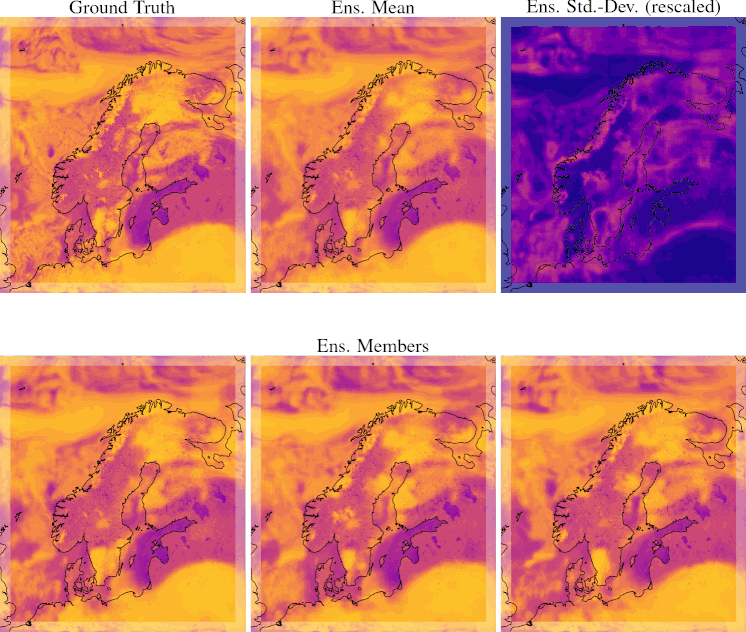

<p align="middle">
    
</p>

Neural-LAM is a repository of graph-based neural weather prediction models.
The code uses [PyTorch](https://pytorch.org/) and [PyTorch Lightning](https://lightning.ai/pytorch-lightning).
Graph Neural Networks are implemented using [PyG](https://pyg.org/) and logging is set up through [Weights & Biases](https://wandb.ai/).

# This Branch: Probabilistic LAM Forecasting
<p align="middle">
    
</p>
<p align="middle">
    <em>Example ensemble forecast from Graph-EFM for net solar longwave radiation.</em>
</p>

This branch contains the code for our paper [*Probabilistic Weather Forecasting with Hierarchical Graph Neural Networks*](https://arxiv.org/abs/2406.04759), for Limited Area Modeling (LAM).
In particular, it contains implementations of:

* Our ensemble forecasting model Graph-EFM.
* The hierarchical Graph-FM model (also called Hi-LAM in [Oskarsson et al. (2023)](https://arxiv.org/abs/2309.17370) and on the `main` branch).
* Our re-implementation of GraphCast, by [Lam et al. (2023)](https://arxiv.org/abs/2212.12794).

If you use these models in your work, please cite:
```
@article{probabilistic_weather_forecasting,
    title={Probabilistic Weather Forecasting with Hierarchical Graph Neural Networks},
    author={Oskarsson, Joel and Landelius, Tomas and Deisenroth, Marc Peter and Lindsten, Fredrik},
    year={2024},
    journal={arXiv preprint}
}
```

We are currently working to merge these models also to the `main` branch of Neural-LAM.
This README describes how to use the different models and run the experiments from the paper.
Do also check the [`main` branch](https://github.com/mllam/neural-lam) for further details and more updated implementations for parts of the codebase.

# Modularity
The Neural-LAM code is designed to modularize the different components involved in training and evaluating neural weather prediction models.
Models, graphs and data are stored separately and it should be possible to swap out individual components.
Still, some restrictions are inevitable:

* The graph used has to be compatible with what the model expects. E.g. a hierarchical model requires a hierarchical graph.
* The graph and data are specific to the limited area under consideration. This is of course true for the data, but also the graph should be created with the exact geometry of the area in mind.

<p align="middle">
  
</p>


## A note on the limited area setting
Currently we are using these models on a limited area covering the Nordic region, the so called MEPS area (see [paper](https://arxiv.org/abs/2309.17370)).
There are still some parts of the code that is quite specific for the MEPS area use case.
This is in particular true for the mesh graph creation (`create_mesh.py`) and some of the constants used (`neural_lam/constants.py`).
Work is being done to refactor the code to be fully area-agnostic.

# Using Neural-LAM
Below follows instructions on how to use Neural-LAM to train and evaluate models.

## Installation
Follow the steps below to create the necessary python environment.

1. Use python 3.10.
2. Install version 2.0.1 of PyTorch. Follow instructions on the [PyTorch webpage](https://pytorch.org/get-started/previous-versions/) for how to set this up with GPU support on your system.
3. Install required packages specified in `requirements.txt`.
4. Install PyTorch Geometric version 2.3.1. This can be done by running
```
TORCH="2.0.1"
CUDA="cu117"

pip install pyg-lib==0.2.0 torch-scatter==2.1.1 torch-sparse==0.6.17 torch-cluster==1.6.1\
    torch-geometric==2.3.1 -f https://pytorch-geometric.com/whl/torch-${TORCH}+${CUDA}.html
```
You will have to adjust the `CUDA` variable to match the CUDA version on your system or to run on CPU. See the [installation webpage](https://pytorch-geometric.readthedocs.io/en/latest/install/installation.html) for more information.

## Data
Datasets should be stored in a directory called `data`.
See the [repository format section](#format-of-data-directory) for details on the directory structure.

The full MEPS dataset is available for download [here](https://nextcloud.liu.se/s/meps). See instructions in the file `README.txt` for how to download and extract the full dataset.

A tiny subset of the MEPS data (named `meps_example`) is also available in `example_data.zip`, which can be downloaded from [here](https://liuonline-my.sharepoint.com/:u:/g/personal/joeos82_liu_se/EaUUq6h9og1EsLwJmKAltWwB7zP2gmObe-K8pL6qGYYiGg?e=yQbFuV).
Download the files and unzip in the neural-lam directory.
After downloading this data, the graphs used in the paper can be generated as described below.
Note that this subset is far too small to train any useful models, but all scripts can be ran with it.
It should thus be useful to make sure that your python environment is set up correctly and that all the code can be ran without any issues.

## Pre-processing
An overview of how the different scripts and files depend on each other is given in this figure:
<p align="middle">
  
</p>
In order to start training models at least three pre-processing scripts have to be ran:

* `create_mesh.py`
* `create_grid_features.py`
* `create_parameter_weights.py`

### Create graph
Run `create_mesh.py` with suitable options to generate the graph you want to use (see `python create_mesh.py --help` for a list of options).
The graphs used in the paper can be created as:

* **multi-scale**: `python create_mesh.py --graph multiscale`
* **hierarchical**: `python create_mesh.py --graph hierarchical --hierarchical 1 --levels 3`

The graph-related files are stored in a directory called `graphs`.

### Create remaining static features
To create the remaining static files run the scripts `create_grid_features.py` and `create_parameter_weights.py`.
The main option to set for these is just which dataset to use.

## Loading Pre-Trained Models

Checkpoints for the pre-trained models from the paper can be downloaded from [here](https://liuonline-my.sharepoint.com/:f:/g/personal/joeos82_liu_se/EkZGlkjMJLhPkaPso_fM3lUB3LGwS_CniSIjWPcFGGOJYA?e=bpHSou). 
The directory `eval_scripts` in this repository contains example scripts that load these checkpoints and run evaluation.
For these scripts to work the downloaded checkpoints should be placed in a directory called `paper_checkpoints` and the graphs named as described above.

## Weights & Biases Integration
The project is fully integrated with [Weights & Biases](https://www.wandb.ai/) (W&B) for logging and visualization, but can just as easily be used without it.
When W&B is used, training configuration, training/test statistics and plots are sent to the W&B servers and made available in an interactive web interface.
If W&B is turned off, logging instead saves everything locally to a directory like `wandb/dryrun...`.
The W&B project name is set to `neural-lam`, but this can be changed in `neural_lam/constants.py`.
See the [W&B documentation](https://docs.wandb.ai/) for details.

If you would like to login and use W&B, run:
```
wandb login
```
If you would like to turn off W&B and just log things locally, run:
```
wandb off
```

## Train Models
Models can be trained using `train_model.py`.
Run `python train_model.py --help` for a full list of training options.
A few of the key ones are outlined below:

* `--dataset`: Which data to train on
* `--model`: Which model to train
* `--graph`: Which graph to use with the model
* `--processor_layers`: Number of GNN layers to use in the processing part of deterministic models, or in the predictor (decoder) for Graph-EFM
* `--encoder_processor_layers`: Number of GNN layers to use in the variatonal approximation for Graph-EFM
* `--prior_processor_layers`: Number of GNN layers to use in the latent map (prior) for Graph-EFM
* `--ar_steps`: Number of time steps to unroll for when making predictions and computing the loss

Checkpoints of trained models are stored in the `saved_models` directory when training.
For detailed hyperparameter settings we refer to the paper, in particular the appendices with model and experiment details.

The implemented models are:

### GraphCast
This is our re-implementation of GraphCast, and really can be used with any type of non-hierarchical graph (not just multi-scale).
The encode-process-decode framework is used with a mesh graph in order to make one-step pedictions.

To train GraphCast use
```
python train_model.py --model graphcast --graph multiscale ...
```

### Graph-FM
Deterministic graph-based forecasting model that uses a hierarchical mesh graph and performs sequential message passing through the hierarchy during processing.

To train Graph-FM use
```
python train_model.py --model graph_fm --graph hierarchical ...
```

### Graph-EFM
This is the probabibilistic graph-based ensemble model.
The same model can be used both with multi-scale and hierarchical graphs, with different behaviour internally.

To train Graph-EFM use e.g.
```
python train_model.py --model graph_efm --graph multiscale ...
```
or
```
python train_model.py --model graph_efm --graph hierarchical ...
```

Checkpoint files for our models trained on the MEPS data are available upon request.

## Evaluate Models
Evaluation is also done using `train_model.py`, but using the `--eval` option.
Use `--eval val` to evaluate the model on the validation set and `--eval test` to evaluate on test data.
Most of the training options are also relevant for evaluation (not `ar_steps`, evaluation always unrolls full forecasts).
Some options specifically important for evaluation are:

* `--load`: Path to model checkpoint file (`.ckpt`) to load parameters from
* `--n_example_pred`: Number of example predictions to plot during evaluation.
* `--ensemble_size`: Number of ensemble members to sample (for Graph-EFM)

**Note:** While it is technically possible to use multiple GPUs for running evaluation, this is strongly discouraged if using a batch size > 1. If using multiple devices the `DistributedSampler` will replicate some samples to make sure all devices have the same batch size, meaning that evaluation metrics will be unreliable. This issue stems from PyTorch Lightning. See for example [this draft PR](https://github.com/Lightning-AI/torchmetrics/pull/1886) for more discussion and ongoing work to remedy this.

# Repository Structure
Except for training and pre-processing scripts all the source code can be found in the `neural_lam` directory.
Model classes, including abstract base classes, are located in `neural_lam/models`.

## Format of data directory
It is possible to store multiple datasets in the `data` directory.
Each dataset contains a set of files with static features and a set of samples.
The samples are split into different sub-directories for training, validation and testing.
The directory structure is shown with examples below.
Script names within parenthesis denote the script used to generate the file.
```
data
├── dataset1
│   ├── samples                             - Directory with data samples
│   │   ├── train                           - Training data
│   │   │   ├── nwp_2022040100_mbr000.npy  - A time series sample
│   │   │   ├── nwp_2022040100_mbr001.npy
│   │   │   ├── ...
│   │   │   ├── nwp_2022043012_mbr001.npy
│   │   │   ├── nwp_toa_downwelling_shortwave_flux_2022040100.npy   - Solar flux forcing
│   │   │   ├── nwp_toa_downwelling_shortwave_flux_2022040112.npy
│   │   │   ├── ...
│   │   │   ├── nwp_toa_downwelling_shortwave_flux_2022043012.npy
│   │   │   ├── wtr_2022040100.npy          - Open water features for one sample
│   │   │   ├── wtr_2022040112.npy
│   │   │   ├── ...
│   │   │   └── wtr_202204012.npy
│   │   ├── val                             - Validation data
│   │   └── test                            - Test data
│   └── static                              - Directory with graph information and static features
│       ├── nwp_xy.npy                      - Coordinates of grid nodes (part of dataset)
│       ├── surface_geopotential.npy        - Geopotential at surface of grid nodes (part of dataset)
│       ├── border_mask.npy                 - Mask with True for grid nodes that are part of border (part of dataset)
│       ├── grid_features.pt                - Static features of grid nodes (create_grid_features.py)
│       ├── parameter_mean.pt               - Means of state parameters (create_parameter_weights.py)
│       ├── parameter_std.pt                - Std.-dev. of state parameters (create_parameter_weights.py)
│       ├── diff_mean.pt                    - Means of one-step differences (create_parameter_weights.py)
│       ├── diff_std.pt                     - Std.-dev. of one-step differences (create_parameter_weights.py)
│       ├── flux_stats.pt                   - Mean and std.-dev. of solar flux forcing (create_parameter_weights.py)
│       └── parameter_weights.npy           - Loss weights for different state parameters (create_parameter_weights.py)
├── dataset2
├── ...
└── datasetN
```

## Format of graph directory
The `graphs` directory contains generated graph structures that can be used by different graph-based models.
The structure is shown with examples below:
```
graphs
├── graph1                                  - Directory with a graph definition
│   ├── m2m_edge_index.pt                   - Edges in mesh graph (create_mesh.py)
│   ├── g2m_edge_index.pt                   - Edges from grid to mesh (create_mesh.py)
│   ├── m2g_edge_index.pt                   - Edges from mesh to grid (create_mesh.py)
│   ├── m2m_features.pt                     - Static features of mesh edges (create_mesh.py)
│   ├── g2m_features.pt                     - Static features of grid to mesh edges (create_mesh.py)
│   ├── m2g_features.pt                     - Static features of mesh to grid edges (create_mesh.py)
│   └── mesh_features.pt                    - Static features of mesh nodes (create_mesh.py)
├── graph2
├── ...
└── graphN
```

### Mesh hierarchy format
To keep track of levels in the mesh graph, a list format is used for the files with mesh graph information.
In particular, the files
```
│   ├── m2m_edge_index.pt                   - Edges in mesh graph (create_mesh.py)
│   ├── m2m_features.pt                     - Static features of mesh edges (create_mesh.py)
│   ├── mesh_features.pt                    - Static features of mesh nodes (create_mesh.py)
```
all contain lists of length `L`, for a hierarchical mesh graph with `L` layers.
For non-hierarchical graphs `L == 1` and these are all just singly-entry lists.
Each entry in the list contains the corresponding edge set or features of that level.
Note that the first level (index 0 in these lists) corresponds to the lowest level in the hierarchy.

In addition, hierarchical mesh graphs (`L > 1`) feature a few additional files with static data:
```
├── graph1
│   ├── ...
│   ├── mesh_down_edge_index.pt             - Downward edges in mesh graph (create_mesh.py)
│   ├── mesh_up_edge_index.pt               - Upward edges in mesh graph (create_mesh.py)
│   ├── mesh_down_features.pt               - Static features of downward mesh edges (create_mesh.py)
│   ├── mesh_up_features.pt                 - Static features of upward mesh edges (create_mesh.py)
│   ├── ...
```
These files have the same list format as the ones above, but each list has length `L-1` (as these edges describe connections between levels).
Entries 0 in these lists describe edges between the lowest levels 1 and 2.

# Contact
For questions about our implementation or ideas for extending it, feel free to get in touch.
You can open a github issue on this page, or (if more suitable) send an email to [joel.oskarsson@liu.se](mailto:joel.oskarsson@liu.se).
