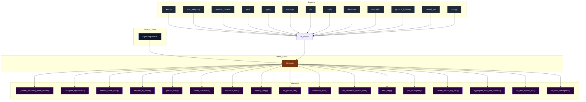

```mermaid
%%{init: {'flowchart': {'nodeSpacing': 60, 'rankSpacing': 80}}}%%
flowchart TD

module["ar_model"]

subgraph Parent_Class
    LightningModule["LightningModule"]
end

subgraph Base_Class
    ARModel["ARModel"]
end

    LightningModule --> ARModel

subgraph Imports
    xarray["xarray"]
    loss_weighting["loss_weighting"]
    weather_dataset["weather_dataset"]
    torch["torch"]
    typing["typing"]
    warnings["warnings"]
    os["os"]
    config["config"]
    datastore["datastore"]
    matplotlib["matplotlib"]
    pytorch_lightning["pytorch_lightning"]
    neural_lam["neural_lam"]
    numpy["numpy"]
end

    xarray --> module
    loss_weighting --> module
    weather_dataset --> module
    torch --> module
    typing --> module
    warnings --> module
    os --> module
    config --> module
    datastore --> module
    matplotlib --> module
    pytorch_lightning --> module
    neural_lam --> module
    numpy --> module
    module --> ARModel

subgraph Methods
    ARModel__create_dataarray_from_tensor["_create_dataarray_from_tensor()"]
    ARModel_configure_optimizers["configure_optimizers()"]
    ARModel_interior_mask_bool["interior_mask_bool()"]
    ARModel_expand_to_batch["expand_to_batch()"]
    ARModel_predict_step["predict_step()"]
    ARModel_unroll_prediction["unroll_prediction()"]
    ARModel_common_step["common_step()"]
    ARModel_training_step["training_step()"]
    ARModel_all_gather_cat["all_gather_cat()"]
    ARModel_validation_step["validation_step()"]
    ARModel_on_validation_epoch_end["on_validation_epoch_end()"]
    ARModel_test_step["test_step()"]
    ARModel_plot_examples["plot_examples()"]
    ARModel_create_metric_log_dict["create_metric_log_dict()"]
    ARModel_aggregate_and_plot_metrics["aggregate_and_plot_metrics()"]
    ARModel_on_test_epoch_end["on_test_epoch_end()"]
    ARModel_on_load_checkpoint["on_load_checkpoint()"]
end

    ARModel --> ARModel__create_dataarray_from_tensor
    ARModel --> ARModel_configure_optimizers
    ARModel --> ARModel_interior_mask_bool
    ARModel --> ARModel_expand_to_batch
    ARModel --> ARModel_predict_step
    ARModel --> ARModel_unroll_prediction
    ARModel --> ARModel_common_step
    ARModel --> ARModel_training_step
    ARModel --> ARModel_all_gather_cat
    ARModel --> ARModel_validation_step
    ARModel --> ARModel_on_validation_epoch_end
    ARModel --> ARModel_test_step
    ARModel --> ARModel_plot_examples
    ARModel --> ARModel_create_metric_log_dict
    ARModel --> ARModel_aggregate_and_plot_metrics
    ARModel --> ARModel_on_test_epoch_end
    ARModel --> ARModel_on_load_checkpoint

classDef parent fill:#0f172a,stroke:#3b82f6,stroke-width:2px,color:#f1f5f9,font-size:16px
classDef base fill:#78350f,stroke:#f59e0b,stroke-width:1px,color:#fde68a,font-size:16px
classDef import fill:#1f2937,stroke:#6b7280,stroke-width:1.5px,color:#e5e7eb,font-size:16px
classDef method fill:#2d043f,stroke:#7c3aed,stroke-width:1.5px,color:#ede9fe,font-size:16px
classDef callNode fill:#064e3b,stroke:#10b981,stroke-width:1.5px,color:#d1fae5,font-size:16px
class LightningModule parent
class ARModel base
class xarray,loss_weighting,weather_dataset,torch,typing,warnings,os,config,datastore,matplotlib,pytorch_lightning,neural_lam,numpy import
class ARModel__create_dataarray_from_tensor,ARModel_configure_optimizers,ARModel_interior_mask_bool,ARModel_expand_to_batch,ARModel_predict_step,ARModel_unroll_prediction,ARModel_common_step,ARModel_training_step,ARModel_all_gather_cat,ARModel_validation_step,ARModel_on_validation_epoch_end,ARModel_test_step,ARModel_plot_examples,ARModel_create_metric_log_dict,ARModel_aggregate_and_plot_metrics,ARModel_on_test_epoch_end,ARModel_on_load_checkpoint method

```