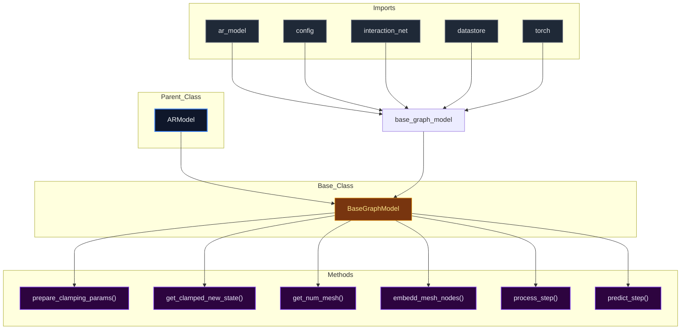

```mermaid
%%{init: {'flowchart': {'nodeSpacing': 60, 'rankSpacing': 80}}}%%
flowchart TD

module["base_graph_model"]

subgraph Parent_Class
    ARModel["ARModel"]
end

subgraph Base_Class
    BaseGraphModel["BaseGraphModel"]
end

    ARModel --> BaseGraphModel

subgraph Imports
    ar_model["ar_model"]
    config["config"]
    interaction_net["interaction_net"]
    datastore["datastore"]
    torch["torch"]
end

    ar_model --> module
    config --> module
    interaction_net --> module
    datastore --> module
    torch --> module
    module --> BaseGraphModel

subgraph Methods
    BaseGraphModel_prepare_clamping_params["prepare_clamping_params()"]
    BaseGraphModel_get_clamped_new_state["get_clamped_new_state()"]
    BaseGraphModel_get_num_mesh["get_num_mesh()"]
    BaseGraphModel_embedd_mesh_nodes["embedd_mesh_nodes()"]
    BaseGraphModel_process_step["process_step()"]
    BaseGraphModel_predict_step["predict_step()"]
end

    BaseGraphModel --> BaseGraphModel_prepare_clamping_params
    BaseGraphModel --> BaseGraphModel_get_clamped_new_state
    BaseGraphModel --> BaseGraphModel_get_num_mesh
    BaseGraphModel --> BaseGraphModel_embedd_mesh_nodes
    BaseGraphModel --> BaseGraphModel_process_step
    BaseGraphModel --> BaseGraphModel_predict_step

classDef parent fill:#0f172a,stroke:#3b82f6,stroke-width:2px,color:#f1f5f9,font-size:16px
classDef base fill:#78350f,stroke:#f59e0b,stroke-width:1px,color:#fde68a,font-size:16px
classDef import fill:#1f2937,stroke:#6b7280,stroke-width:1.5px,color:#e5e7eb,font-size:16px
classDef method fill:#2d043f,stroke:#7c3aed,stroke-width:1.5px,color:#ede9fe,font-size:16px
classDef callNode fill:#064e3b,stroke:#10b981,stroke-width:1.5px,color:#d1fae5,font-size:16px
class ARModel parent
class BaseGraphModel base
class ar_model,config,interaction_net,datastore,torch import
class BaseGraphModel_prepare_clamping_params,BaseGraphModel_get_clamped_new_state,BaseGraphModel_get_num_mesh,BaseGraphModel_embedd_mesh_nodes,BaseGraphModel_process_step,BaseGraphModel_predict_step method

```