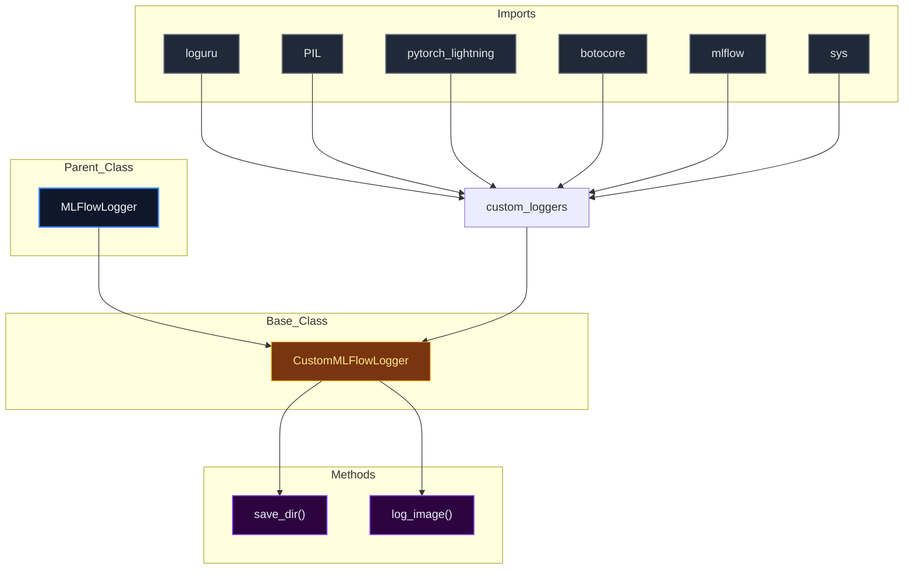

```mermaid
%%{init: {'flowchart': {'nodeSpacing': 60, 'rankSpacing': 80}}}%%
flowchart TD

module["custom_loggers"]

subgraph Parent_Class
    MLFlowLogger["MLFlowLogger"]
end

subgraph Base_Class
    CustomMLFlowLogger["CustomMLFlowLogger"]
end

    MLFlowLogger --> CustomMLFlowLogger

subgraph Imports
    loguru["loguru"]
    PIL["PIL"]
    pytorch_lightning["pytorch_lightning"]
    botocore["botocore"]
    mlflow["mlflow"]
    sys["sys"]
end

    loguru --> module
    PIL --> module
    pytorch_lightning --> module
    botocore --> module
    mlflow --> module
    sys --> module
    module --> CustomMLFlowLogger

subgraph Methods
    CustomMLFlowLogger_save_dir["save_dir()"]
    CustomMLFlowLogger_log_image["log_image()"]
end

    CustomMLFlowLogger --> CustomMLFlowLogger_save_dir
    CustomMLFlowLogger --> CustomMLFlowLogger_log_image

classDef parent fill:#0f172a,stroke:#3b82f6,stroke-width:2px,color:#f1f5f9,font-size:16px
classDef base fill:#78350f,stroke:#f59e0b,stroke-width:1px,color:#fde68a,font-size:16px
classDef import fill:#1f2937,stroke:#6b7280,stroke-width:1.5px,color:#e5e7eb,font-size:16px
classDef method fill:#2d043f,stroke:#7c3aed,stroke-width:1.5px,color:#ede9fe,font-size:16px
classDef callNode fill:#064e3b,stroke:#10b981,stroke-width:1.5px,color:#d1fae5,font-size:16px
class MLFlowLogger parent
class CustomMLFlowLogger base
class loguru,PIL,pytorch_lightning,botocore,mlflow,sys import
class CustomMLFlowLogger_save_dir,CustomMLFlowLogger_log_image method

```
