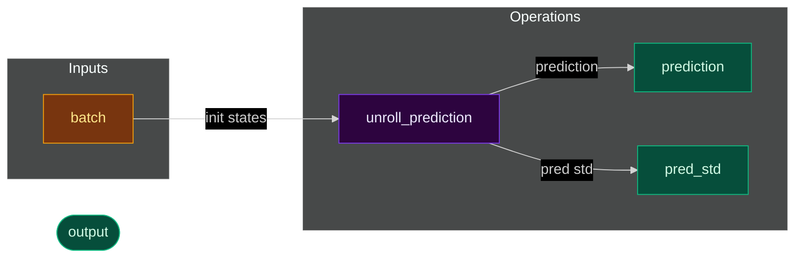

# Dataflow: `ar_model`

```mermaid
%%{init: {'theme': 'dark', 'themeVariables': {'edgeLabelBackground': '#000000'}, 'flowchart': {'nodeSpacing': 60, 'rankSpacing': 80}}}%%
flowchart LR

subgraph Inputs
    batch["batch"]
end

subgraph Operations
    unroll_prediction["unroll_prediction"]
    prediction["prediction"]
    pred_std["pred_std"]
end

    output(["output"])

    batch -->|"init states"| unroll_prediction
    unroll_prediction -->|"prediction"| prediction
    unroll_prediction -->|"pred std"| pred_std

classDef base fill:#78350f,stroke:#f59e0b,color:#fde68a
classDef method fill:#2d043f,stroke:#7c3aed,color:#ede9fe
classDef callNode fill:#064e3b,stroke:#10b981,color:#d1fae5

class batch base
class unroll_prediction method
class prediction,pred_std,output callNode
```
