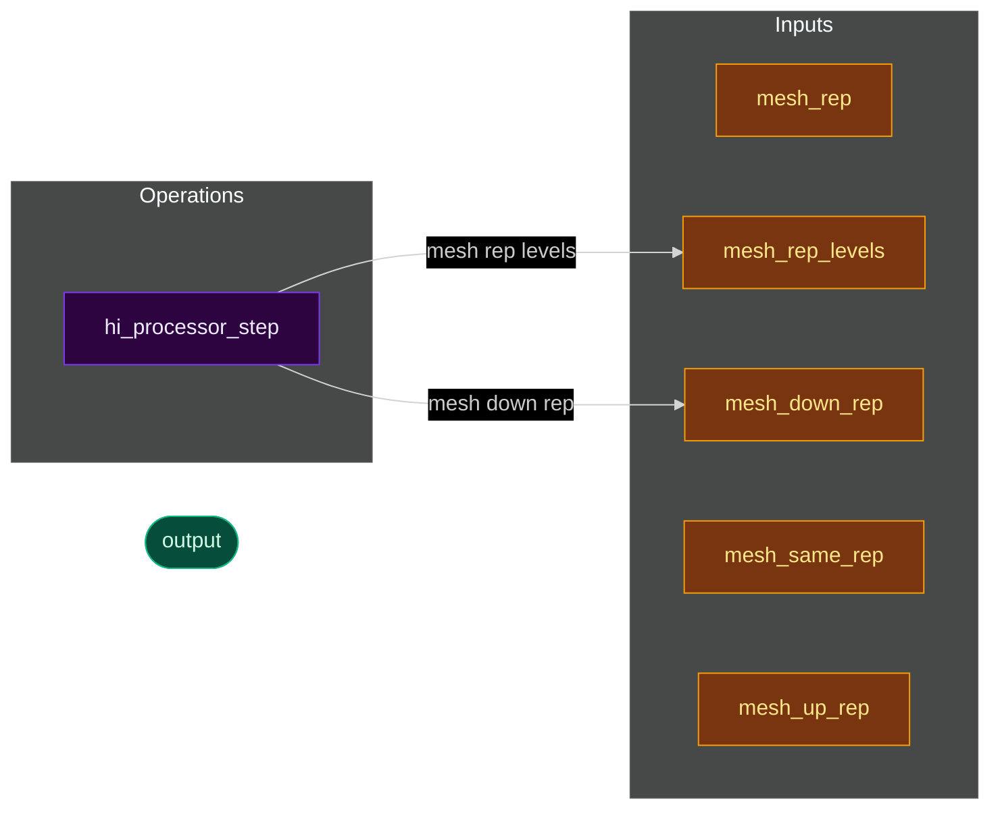

# Dataflow: `base_hi_graph_model`

```mermaid
%%{init: {'theme': 'dark', 'themeVariables': {'edgeLabelBackground': '#000000'}, 'flowchart': {'nodeSpacing': 60, 'rankSpacing': 80}}}%%
flowchart LR

subgraph Inputs
    mesh_rep["mesh_rep"]
    mesh_rep_levels["mesh_rep_levels"]
    mesh_down_rep["mesh_down_rep"]
    mesh_same_rep["mesh_same_rep"]
    mesh_up_rep["mesh_up_rep"]
end

subgraph Operations
    hi_processor_step["hi_processor_step"]
end

    output(["output"])

    hi_processor_step -->|"mesh rep levels"| mesh_rep_levels
    hi_processor_step -->|"mesh down rep"| mesh_down_rep

classDef base fill:#78350f,stroke:#f59e0b,color:#fde68a
classDef method fill:#2d043f,stroke:#7c3aed,color:#ede9fe
classDef callNode fill:#064e3b,stroke:#10b981,color:#d1fae5

class mesh_rep,mesh_rep_levels,mesh_down_rep,mesh_same_rep,mesh_up_rep base
class hi_processor_step method
class output callNode
```
