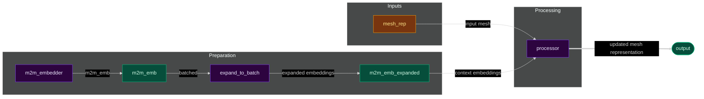

# Dataflow: `graph_lam`

```mermaid
%%{init: {'theme': 'dark', 'themeVariables': {'edgeLabelBackground': '#000000'}, 'flowchart': {'nodeSpacing': 60, 'rankSpacing': 80}}}%%
flowchart LR

subgraph Inputs
    mesh_rep["mesh_rep"]
end

subgraph Preparation
    m2m_embedder["m2m_embedder"]
    expand_to_batch["expand_to_batch"]
    m2m_emb["m2m_emb"]
    m2m_emb_expanded["m2m_emb_expanded"]
end

subgraph Processing
    processor["processor"]
end

    output(["output"])

    m2m_embedder -->|"m2m_emb"| m2m_emb
    m2m_emb -->|"batched"| expand_to_batch
    expand_to_batch -->|"expanded embeddings"| m2m_emb_expanded
    mesh_rep -->|"input mesh"| processor
    m2m_emb_expanded -->|"context embeddings"| processor
    processor ==>|"updated mesh representation"| output

classDef base fill:#78350f,stroke:#f59e0b,color:#fde68a
classDef method fill:#2d043f,stroke:#7c3aed,color:#ede9fe
classDef callNode fill:#064e3b,stroke:#10b981,color:#d1fae5

class mesh_rep base
class m2m_embedder,expand_to_batch,processor method
class m2m_emb,m2m_emb_expanded,output callNode
```
