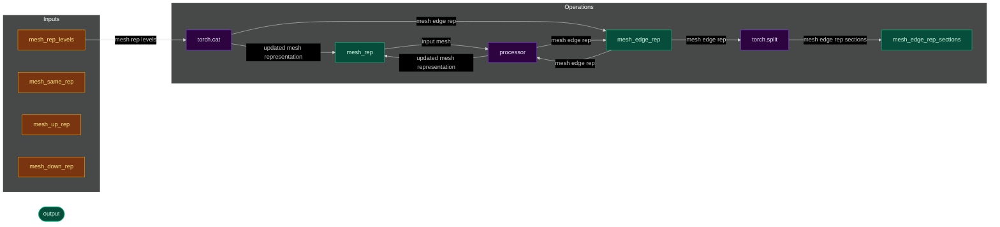

# Dataflow: `hi_lam_parallel`

```mermaid
%%{init: {'theme': 'dark', 'themeVariables': {'edgeLabelBackground': '#000000'}, 'flowchart': {'nodeSpacing': 60, 'rankSpacing': 80}}}%%
flowchart LR

subgraph Inputs
    mesh_rep_levels["mesh_rep_levels"]
    mesh_same_rep["mesh_same_rep"]
    mesh_up_rep["mesh_up_rep"]
    mesh_down_rep["mesh_down_rep"]
end

subgraph Operations
    torch.cat["torch.cat"]
    processor["processor"]
    torch.split["torch.split"]
    mesh_rep["mesh_rep"]
    mesh_edge_rep["mesh_edge_rep"]
    mesh_edge_rep_sections["mesh_edge_rep_sections"]
end

    output(["output"])

    mesh_rep_levels -->|"mesh rep levels"| torch.cat
    torch.cat -->|"updated mesh representation"| mesh_rep
    torch.cat -->|"mesh edge rep"| mesh_edge_rep
    mesh_rep -->|"input mesh"| processor
    mesh_edge_rep -->|"mesh edge rep"| processor
    processor -->|"updated mesh representation"| mesh_rep
    processor -->|"mesh edge rep"| mesh_edge_rep
    mesh_edge_rep -->|"mesh edge rep"| torch.split
    torch.split -->|"mesh edge rep sections"| mesh_edge_rep_sections

classDef base fill:#78350f,stroke:#f59e0b,color:#fde68a
classDef method fill:#2d043f,stroke:#7c3aed,color:#ede9fe
classDef callNode fill:#064e3b,stroke:#10b981,color:#d1fae5

class mesh_rep_levels,mesh_same_rep,mesh_up_rep,mesh_down_rep base
class torch.cat,processor,torch.split method
class mesh_rep,mesh_edge_rep,mesh_edge_rep_sections,output callNode
```
