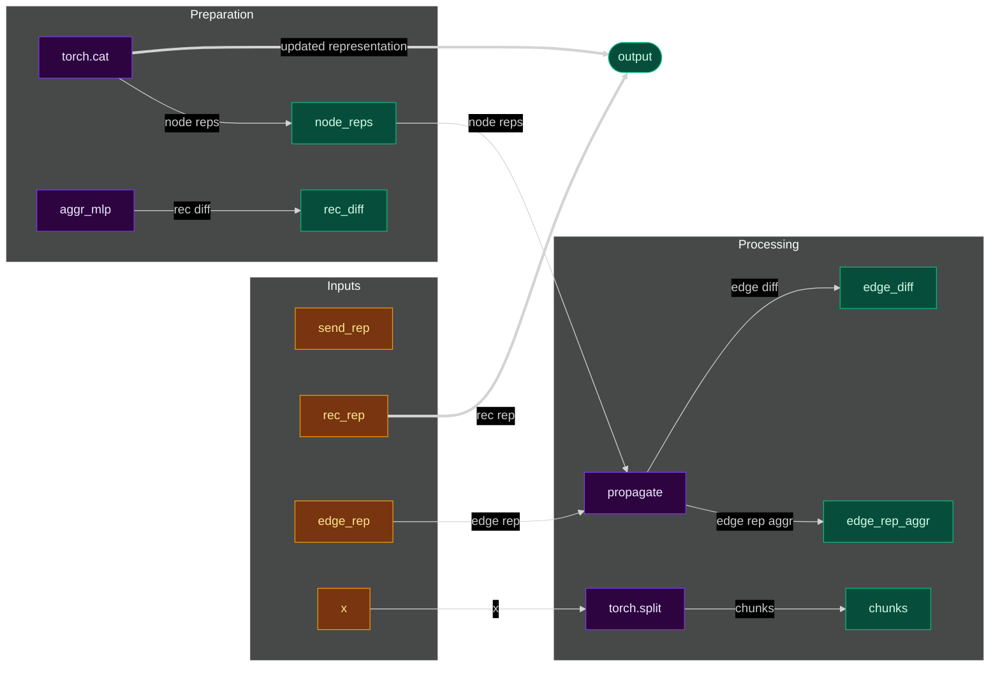

# Dataflow: `interaction_net`

```mermaid
%%{init: {'theme': 'dark', 'themeVariables': {'edgeLabelBackground': '#000000'}, 'flowchart': {'nodeSpacing': 60, 'rankSpacing': 80}}}%%
flowchart LR

subgraph Inputs
    send_rep["send_rep"]
    rec_rep["rec_rep"]
    edge_rep["edge_rep"]
    x["x"]
end

subgraph Preparation
    torch.cat["torch.cat"]
    aggr_mlp["aggr_mlp"]
    node_reps["node_reps"]
    rec_diff["rec_diff"]
end

subgraph Processing
    propagate["propagate"]
    torch.split["torch.split"]
    edge_rep_aggr["edge_rep_aggr"]
    edge_diff["edge_diff"]
    chunks["chunks"]
end

    output(["output"])

    torch.cat -->|"node reps"| node_reps
    node_reps -->|"node reps"| propagate
    edge_rep -->|"edge rep"| propagate
    propagate -->|"edge rep aggr"| edge_rep_aggr
    propagate -->|"edge diff"| edge_diff
    aggr_mlp -->|"rec diff"| rec_diff
    rec_rep ==>|"rec rep"| output
    x -->|"x"| torch.split
    torch.split -->|"chunks"| chunks
    torch.cat ==>|"updated representation"| output

classDef base fill:#78350f,stroke:#f59e0b,color:#fde68a
classDef method fill:#2d043f,stroke:#7c3aed,color:#ede9fe
classDef callNode fill:#064e3b,stroke:#10b981,color:#d1fae5

class send_rep,rec_rep,edge_rep,x base
class torch.cat,propagate,aggr_mlp,torch.split method
class node_reps,edge_rep_aggr,edge_diff,rec_diff,chunks,output callNode
```
