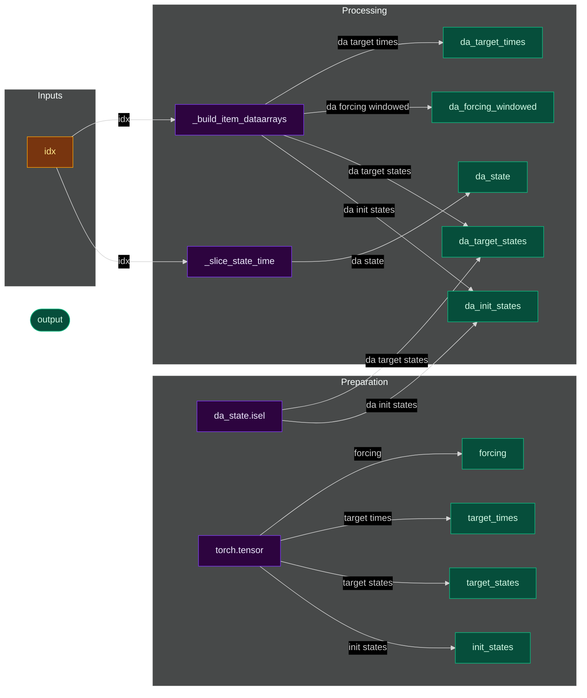

# Dataflow: `weather_dataset`

```mermaid
%%{init: {'theme': 'dark', 'themeVariables': {'edgeLabelBackground': '#000000'}, 'flowchart': {'nodeSpacing': 60, 'rankSpacing': 80}}}%%
flowchart LR

subgraph Inputs
    idx["idx"]
end

subgraph Preparation
    da_state.isel["da_state.isel"]
    torch.tensor["torch.tensor"]
    init_states["init_states"]
    target_states["target_states"]
    target_times["target_times"]
    forcing["forcing"]
end

subgraph Processing
    _slice_state_time["_slice_state_time"]
    _build_item_dataarrays["_build_item_dataarrays"]
    da_state["da_state"]
    da_init_states["da_init_states"]
    da_target_states["da_target_states"]
    da_forcing_windowed["da_forcing_windowed"]
    da_target_times["da_target_times"]
end

    output(["output"])

    idx -->|"idx"| _slice_state_time
    _slice_state_time -->|"da state"| da_state
    da_state.isel -->|"da init states"| da_init_states
    da_state.isel -->|"da target states"| da_target_states
    idx -->|"idx"| _build_item_dataarrays
    _build_item_dataarrays -->|"da init states"| da_init_states
    _build_item_dataarrays -->|"da target states"| da_target_states
    _build_item_dataarrays -->|"da forcing windowed"| da_forcing_windowed
    _build_item_dataarrays -->|"da target times"| da_target_times
    torch.tensor -->|"init states"| init_states
    torch.tensor -->|"target states"| target_states
    torch.tensor -->|"target times"| target_times
    torch.tensor -->|"forcing"| forcing

classDef base fill:#78350f,stroke:#f59e0b,color:#fde68a
classDef method fill:#2d043f,stroke:#7c3aed,color:#ede9fe
classDef callNode fill:#064e3b,stroke:#10b981,color:#d1fae5

class idx base
class _slice_state_time,da_state.isel,_build_item_dataarrays,torch.tensor method
class da_state,da_init_states,da_target_states,da_forcing_windowed,da_target_times,init_states,target_states,target_times,forcing,output callNode
```
