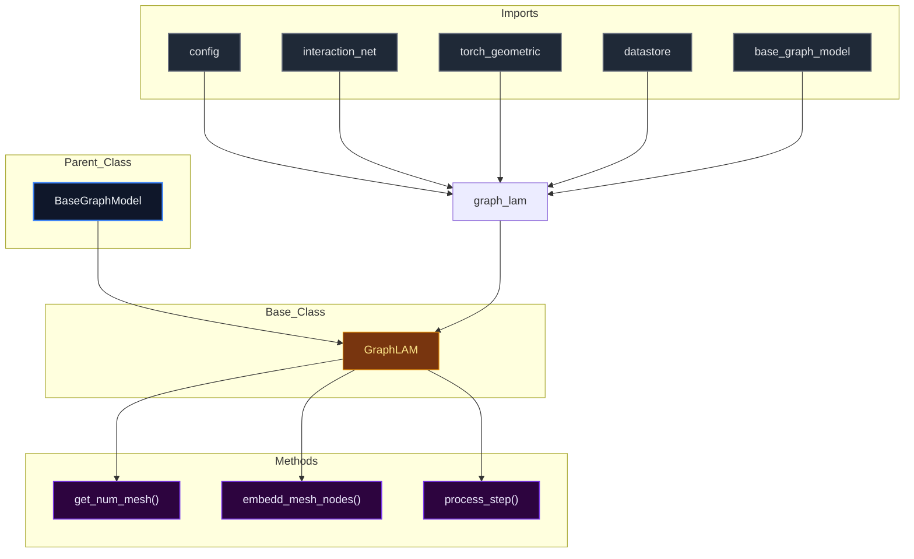

```mermaid
%%{init: {'flowchart': {'nodeSpacing': 60, 'rankSpacing': 80}}}%%
flowchart TD

module["graph_lam"]

subgraph Parent_Class
    BaseGraphModel["BaseGraphModel"]
end

subgraph Base_Class
    GraphLAM["GraphLAM"]
end

    BaseGraphModel --> GraphLAM

subgraph Imports
    config["config"]
    interaction_net["interaction_net"]
    torch_geometric["torch_geometric"]
    datastore["datastore"]
    base_graph_model["base_graph_model"]
end

    config --> module
    interaction_net --> module
    torch_geometric --> module
    datastore --> module
    base_graph_model --> module
    module --> GraphLAM

subgraph Methods
    GraphLAM_get_num_mesh["get_num_mesh()"]
    GraphLAM_embedd_mesh_nodes["embedd_mesh_nodes()"]
    GraphLAM_process_step["process_step()"]
end

    GraphLAM --> GraphLAM_get_num_mesh
    GraphLAM --> GraphLAM_embedd_mesh_nodes
    GraphLAM --> GraphLAM_process_step

classDef parent fill:#0f172a,stroke:#3b82f6,stroke-width:2px,color:#f1f5f9,font-size:16px
classDef base fill:#78350f,stroke:#f59e0b,stroke-width:1px,color:#fde68a,font-size:16px
classDef import fill:#1f2937,stroke:#6b7280,stroke-width:1.5px,color:#e5e7eb,font-size:16px
classDef method fill:#2d043f,stroke:#7c3aed,stroke-width:1.5px,color:#ede9fe,font-size:16px
classDef callNode fill:#064e3b,stroke:#10b981,stroke-width:1.5px,color:#d1fae5,font-size:16px
class BaseGraphModel parent
class GraphLAM base
class config,interaction_net,torch_geometric,datastore,base_graph_model import
class GraphLAM_get_num_mesh,GraphLAM_embedd_mesh_nodes,GraphLAM_process_step method

```