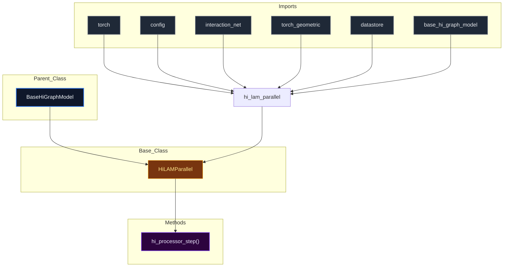

```mermaid
%%{init: {'flowchart': {'nodeSpacing': 60, 'rankSpacing': 80}}}%%
flowchart TD

module["hi_lam_parallel"]

subgraph Parent_Class
    BaseHiGraphModel["BaseHiGraphModel"]
end

subgraph Base_Class
    HiLAMParallel["HiLAMParallel"]
end

    BaseHiGraphModel --> HiLAMParallel

subgraph Imports
    torch["torch"]
    config["config"]
    interaction_net["interaction_net"]
    torch_geometric["torch_geometric"]
    datastore["datastore"]
    base_hi_graph_model["base_hi_graph_model"]
end

    torch --> module
    config --> module
    interaction_net --> module
    torch_geometric --> module
    datastore --> module
    base_hi_graph_model --> module
    module --> HiLAMParallel

subgraph Methods
    HiLAMParallel_hi_processor_step["hi_processor_step()"]
end

    HiLAMParallel --> HiLAMParallel_hi_processor_step

classDef parent fill:#0f172a,stroke:#3b82f6,stroke-width:2px,color:#f1f5f9,font-size:16px
classDef base fill:#78350f,stroke:#f59e0b,stroke-width:1px,color:#fde68a,font-size:16px
classDef import fill:#1f2937,stroke:#6b7280,stroke-width:1.5px,color:#e5e7eb,font-size:16px
classDef method fill:#2d043f,stroke:#7c3aed,stroke-width:1.5px,color:#ede9fe,font-size:16px
classDef callNode fill:#064e3b,stroke:#10b981,stroke-width:1.5px,color:#d1fae5,font-size:16px
class BaseHiGraphModel parent
class HiLAMParallel base
class torch,config,interaction_net,torch_geometric,datastore,base_hi_graph_model import
class HiLAMParallel_hi_processor_step method

```
