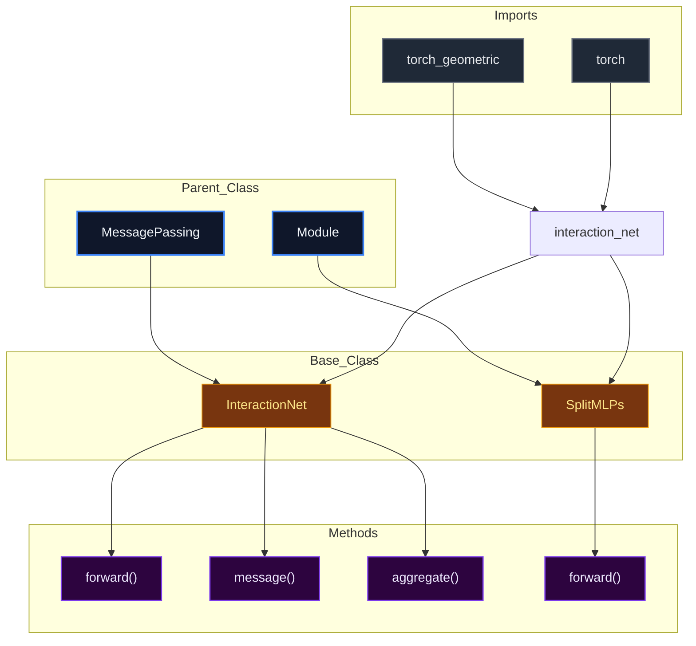

```mermaid
%%{init: {'flowchart': {'nodeSpacing': 60, 'rankSpacing': 80}}}%%
flowchart TD

module["interaction_net"]

subgraph Parent_Class
    MessagePassing["MessagePassing"]
    Module["Module"]
end

subgraph Base_Class
    InteractionNet["InteractionNet"]
    SplitMLPs["SplitMLPs"]
end

    MessagePassing --> InteractionNet
    Module --> SplitMLPs

subgraph Imports
    torch_geometric["torch_geometric"]
    torch["torch"]
end

    torch_geometric --> module
    torch --> module
    module --> InteractionNet
    module --> SplitMLPs

subgraph Methods
    InteractionNet_forward["forward()"]
    InteractionNet_message["message()"]
    InteractionNet_aggregate["aggregate()"]
    SplitMLPs_forward["forward()"]
end

    InteractionNet --> InteractionNet_forward
    InteractionNet --> InteractionNet_message
    InteractionNet --> InteractionNet_aggregate
    SplitMLPs --> SplitMLPs_forward

classDef parent fill:#0f172a,stroke:#3b82f6,stroke-width:2px,color:#f1f5f9,font-size:16px
classDef base fill:#78350f,stroke:#f59e0b,stroke-width:1px,color:#fde68a,font-size:16px
classDef import fill:#1f2937,stroke:#6b7280,stroke-width:1.5px,color:#e5e7eb,font-size:16px
classDef method fill:#2d043f,stroke:#7c3aed,stroke-width:1.5px,color:#ede9fe,font-size:16px
classDef callNode fill:#064e3b,stroke:#10b981,stroke-width:1.5px,color:#d1fae5,font-size:16px
class MessagePassing,Module parent
class InteractionNet,SplitMLPs base
class torch_geometric,torch import
class InteractionNet_forward,InteractionNet_message,InteractionNet_aggregate,SplitMLPs_forward method

```