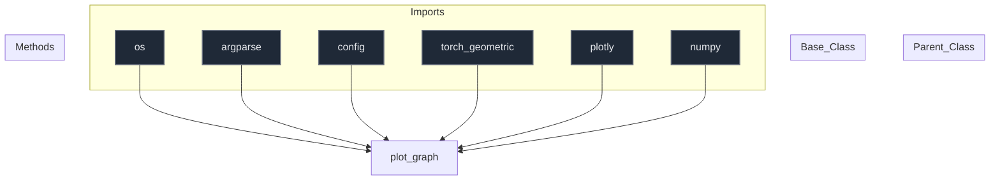

```mermaid
%%{init: {'flowchart': {'nodeSpacing': 60, 'rankSpacing': 80}}}%%
flowchart TD

module["plot_graph"]

subgraph Parent_Class
end

subgraph Base_Class
end


subgraph Imports
    os["os"]
    argparse["argparse"]
    config["config"]
    torch_geometric["torch_geometric"]
    plotly["plotly"]
    numpy["numpy"]
end

    os --> module
    argparse --> module
    config --> module
    torch_geometric --> module
    plotly --> module
    numpy --> module

subgraph Methods
end


classDef parent fill:#0f172a,stroke:#3b82f6,stroke-width:2px,color:#f1f5f9,font-size:16px
classDef base fill:#78350f,stroke:#f59e0b,stroke-width:1px,color:#fde68a,font-size:16px
classDef import fill:#1f2937,stroke:#6b7280,stroke-width:1.5px,color:#e5e7eb,font-size:16px
classDef method fill:#2d043f,stroke:#7c3aed,stroke-width:1.5px,color:#ede9fe,font-size:16px
classDef callNode fill:#064e3b,stroke:#10b981,stroke-width:1.5px,color:#d1fae5,font-size:16px
class os,argparse,config,torch_geometric,plotly,numpy import

```