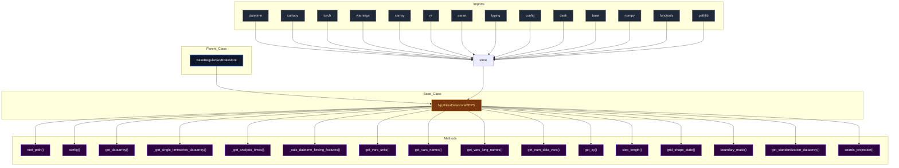

```mermaid
%%{init: {'flowchart': {'nodeSpacing': 60, 'rankSpacing': 80}}}%%
flowchart TD

module["store"]

subgraph Parent_Class
    BaseRegularGridDatastore["BaseRegularGridDatastore"]
end

subgraph Base_Class
    NpyFilesDatastoreMEPS["NpyFilesDatastoreMEPS"]
end

    BaseRegularGridDatastore --> NpyFilesDatastoreMEPS

subgraph Imports
    datetime["datetime"]
    cartopy["cartopy"]
    torch["torch"]
    warnings["warnings"]
    xarray["xarray"]
    re["re"]
    parse["parse"]
    typing["typing"]
    config["config"]
    dask["dask"]
    base["base"]
    numpy["numpy"]
    functools["functools"]
    pathlib["pathlib"]
end

    datetime --> module
    cartopy --> module
    torch --> module
    warnings --> module
    xarray --> module
    re --> module
    parse --> module
    typing --> module
    config --> module
    dask --> module
    base --> module
    numpy --> module
    functools --> module
    pathlib --> module
    module --> NpyFilesDatastoreMEPS

subgraph Methods
    NpyFilesDatastoreMEPS_root_path["root_path()"]
    NpyFilesDatastoreMEPS_config["config()"]
    NpyFilesDatastoreMEPS_get_dataarray["get_dataarray()"]
    NpyFilesDatastoreMEPS__get_single_timeseries_dataarray["_get_single_timeseries_dataarray()"]
    NpyFilesDatastoreMEPS__get_analysis_times["_get_analysis_times()"]
    NpyFilesDatastoreMEPS__calc_datetime_forcing_features["_calc_datetime_forcing_features()"]
    NpyFilesDatastoreMEPS_get_vars_units["get_vars_units()"]
    NpyFilesDatastoreMEPS_get_vars_names["get_vars_names()"]
    NpyFilesDatastoreMEPS_get_vars_long_names["get_vars_long_names()"]
    NpyFilesDatastoreMEPS_get_num_data_vars["get_num_data_vars()"]
    NpyFilesDatastoreMEPS_get_xy["get_xy()"]
    NpyFilesDatastoreMEPS_step_length["step_length()"]
    NpyFilesDatastoreMEPS_grid_shape_state["grid_shape_state()"]
    NpyFilesDatastoreMEPS_boundary_mask["boundary_mask()"]
    NpyFilesDatastoreMEPS_get_standardization_dataarray["get_standardization_dataarray()"]
    NpyFilesDatastoreMEPS_coords_projection["coords_projection()"]
end

    NpyFilesDatastoreMEPS --> NpyFilesDatastoreMEPS_root_path
    NpyFilesDatastoreMEPS --> NpyFilesDatastoreMEPS_config
    NpyFilesDatastoreMEPS --> NpyFilesDatastoreMEPS_get_dataarray
    NpyFilesDatastoreMEPS --> NpyFilesDatastoreMEPS__get_single_timeseries_dataarray
    NpyFilesDatastoreMEPS --> NpyFilesDatastoreMEPS__get_analysis_times
    NpyFilesDatastoreMEPS --> NpyFilesDatastoreMEPS__calc_datetime_forcing_features
    NpyFilesDatastoreMEPS --> NpyFilesDatastoreMEPS_get_vars_units
    NpyFilesDatastoreMEPS --> NpyFilesDatastoreMEPS_get_vars_names
    NpyFilesDatastoreMEPS --> NpyFilesDatastoreMEPS_get_vars_long_names
    NpyFilesDatastoreMEPS --> NpyFilesDatastoreMEPS_get_num_data_vars
    NpyFilesDatastoreMEPS --> NpyFilesDatastoreMEPS_get_xy
    NpyFilesDatastoreMEPS --> NpyFilesDatastoreMEPS_step_length
    NpyFilesDatastoreMEPS --> NpyFilesDatastoreMEPS_grid_shape_state
    NpyFilesDatastoreMEPS --> NpyFilesDatastoreMEPS_boundary_mask
    NpyFilesDatastoreMEPS --> NpyFilesDatastoreMEPS_get_standardization_dataarray
    NpyFilesDatastoreMEPS --> NpyFilesDatastoreMEPS_coords_projection

classDef parent fill:#0f172a,stroke:#3b82f6,stroke-width:2px,color:#f1f5f9,font-size:16px
classDef base fill:#78350f,stroke:#f59e0b,stroke-width:1px,color:#fde68a,font-size:16px
classDef import fill:#1f2937,stroke:#6b7280,stroke-width:1.5px,color:#e5e7eb,font-size:16px
classDef method fill:#2d043f,stroke:#7c3aed,stroke-width:1.5px,color:#ede9fe,font-size:16px
classDef callNode fill:#064e3b,stroke:#10b981,stroke-width:1.5px,color:#d1fae5,font-size:16px
class BaseRegularGridDatastore parent
class NpyFilesDatastoreMEPS base
class datetime,cartopy,torch,warnings,xarray,re,parse,typing,config,dask,base,numpy,functools,pathlib import
class NpyFilesDatastoreMEPS_root_path,NpyFilesDatastoreMEPS_config,NpyFilesDatastoreMEPS_get_dataarray,NpyFilesDatastoreMEPS__get_single_timeseries_dataarray,NpyFilesDatastoreMEPS__get_analysis_times,NpyFilesDatastoreMEPS__calc_datetime_forcing_features,NpyFilesDatastoreMEPS_get_vars_units,NpyFilesDatastoreMEPS_get_vars_names,NpyFilesDatastoreMEPS_get_vars_long_names,NpyFilesDatastoreMEPS_get_num_data_vars,NpyFilesDatastoreMEPS_get_xy,NpyFilesDatastoreMEPS_step_length,NpyFilesDatastoreMEPS_grid_shape_state,NpyFilesDatastoreMEPS_boundary_mask,NpyFilesDatastoreMEPS_get_standardization_dataarray,NpyFilesDatastoreMEPS_coords_projection method

```
