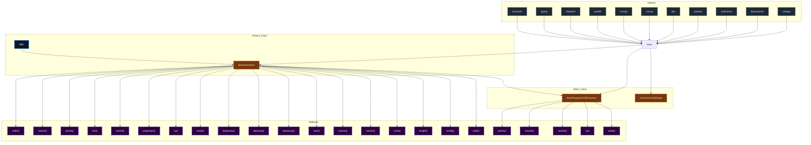

```mermaid
%%{init: {'flowchart': {'nodeSpacing': 60, 'rankSpacing': 80}}}%%
flowchart TD

module["base"]

subgraph Parent_Class
    BaseDatastore["BaseDatastore"]
    ABC["ABC"]
end

subgraph Base_Class
    CartesianGridShape["CartesianGridShape"]
    BaseDatastore["BaseDatastore"]
    BaseRegularGridDatastore["BaseRegularGridDatastore"]
end

    ABC --> BaseDatastore
    BaseDatastore --> BaseRegularGridDatastore

subgraph Imports
    functools["functools"]
    typing["typing"]
    datetime["datetime"]
    pathlib["pathlib"]
    numpy["numpy"]
    xarray["xarray"]
    abc["abc"]
    pandas["pandas"]
    collections["collections"]
    dataclasses["dataclasses"]
    cartopy["cartopy"]
end

    functools --> module
    typing --> module
    datetime --> module
    pathlib --> module
    numpy --> module
    xarray --> module
    abc --> module
    pandas --> module
    collections --> module
    dataclasses --> module
    cartopy --> module
    module --> CartesianGridShape
    module --> BaseDatastore
    module --> BaseRegularGridDatastore

subgraph Methods
    BaseDatastore_root_path["path()"]
    BaseDatastore_config["config()"]
    BaseDatastore_step_length["length()"]
    BaseDatastore_get_vars_units["units()"]
    BaseDatastore_get_vars_names["names()"]
    BaseDatastore_get_vars_long_names["names()"]
    BaseDatastore_get_num_data_vars["vars()"]
    BaseDatastore_get_standardization_dataarray["dataarray()"]
    BaseDatastore__standardize_datarray["datarray()"]
    BaseDatastore_get_dataarray["dataarray()"]
    BaseDatastore_boundary_mask["mask()"]
    BaseDatastore_get_xy["xy()"]
    BaseDatastore_coords_projection["projection()"]
    BaseDatastore_get_xy_extent["extent()"]
    BaseDatastore_get_lat_lon["lon()"]
    BaseDatastore_num_grid_points["points()"]
    BaseDatastore_state_feature_weights_values["values()"]
    BaseDatastore_expected_dim_order["order()"]
    BaseRegularGridDatastore_grid_shape_state["state()"]
    BaseRegularGridDatastore_get_xy["xy()"]
    BaseRegularGridDatastore_unstack_grid_coords["coords()"]
    BaseRegularGridDatastore_stack_grid_coords["coords()"]
    BaseRegularGridDatastore_num_grid_points["points()"]
end

    BaseDatastore --> BaseDatastore_root_path
    BaseDatastore --> BaseDatastore_config
    BaseDatastore --> BaseDatastore_step_length
    BaseDatastore --> BaseDatastore_get_vars_units
    BaseDatastore --> BaseDatastore_get_vars_names
    BaseDatastore --> BaseDatastore_get_vars_long_names
    BaseDatastore --> BaseDatastore_get_num_data_vars
    BaseDatastore --> BaseDatastore_get_standardization_dataarray
    BaseDatastore --> BaseDatastore__standardize_datarray
    BaseDatastore --> BaseDatastore_get_dataarray
    BaseDatastore --> BaseDatastore_boundary_mask
    BaseDatastore --> BaseDatastore_get_xy
    BaseDatastore --> BaseDatastore_coords_projection
    BaseDatastore --> BaseDatastore_get_xy_extent
    BaseDatastore --> BaseDatastore_get_lat_lon
    BaseDatastore --> BaseDatastore_num_grid_points
    BaseDatastore --> BaseDatastore_state_feature_weights_values
    BaseDatastore --> BaseDatastore_expected_dim_order
    BaseRegularGridDatastore --> BaseRegularGridDatastore_grid_shape_state
    BaseRegularGridDatastore --> BaseRegularGridDatastore_get_xy
    BaseRegularGridDatastore --> BaseRegularGridDatastore_unstack_grid_coords
    BaseRegularGridDatastore --> BaseRegularGridDatastore_stack_grid_coords
    BaseRegularGridDatastore --> BaseRegularGridDatastore_num_grid_points

classDef parent fill:#0f172a,stroke:#3b82f6,stroke-width:2px,color:#f1f5f9,font-size:16px
classDef base fill:#78350f,stroke:#f59e0b,stroke-width:1px,color:#fde68a,font-size:16px
classDef import fill:#1f2937,stroke:#6b7280,stroke-width:1.5px,color:#e5e7eb,font-size:16px
classDef method fill:#2d043f,stroke:#7c3aed,stroke-width:1.5px,color:#ede9fe,font-size:16px
classDef callNode fill:#064e3b,stroke:#10b981,stroke-width:1.5px,color:#d1fae5,font-size:16px
class BaseDatastore,ABC parent
class CartesianGridShape,BaseDatastore,BaseRegularGridDatastore base
class functools,typing,datetime,pathlib,numpy,xarray,abc,pandas,collections,dataclasses,cartopy import
class BaseDatastore_root_path,BaseDatastore_config,BaseDatastore_step_length,BaseDatastore_get_vars_units,BaseDatastore_get_vars_names,BaseDatastore_get_vars_long_names,BaseDatastore_get_num_data_vars,BaseDatastore_get_standardization_dataarray,BaseDatastore__standardize_datarray,BaseDatastore_get_dataarray,BaseDatastore_boundary_mask,BaseDatastore_get_xy,BaseDatastore_coords_projection,BaseDatastore_get_xy_extent,BaseDatastore_get_lat_lon,BaseDatastore_num_grid_points,BaseDatastore_state_feature_weights_values,BaseDatastore_expected_dim_order,BaseRegularGridDatastore_grid_shape_state,BaseRegularGridDatastore_get_xy,BaseRegularGridDatastore_unstack_grid_coords,BaseRegularGridDatastore_stack_grid_coords,BaseRegularGridDatastore_num_grid_points method
```
