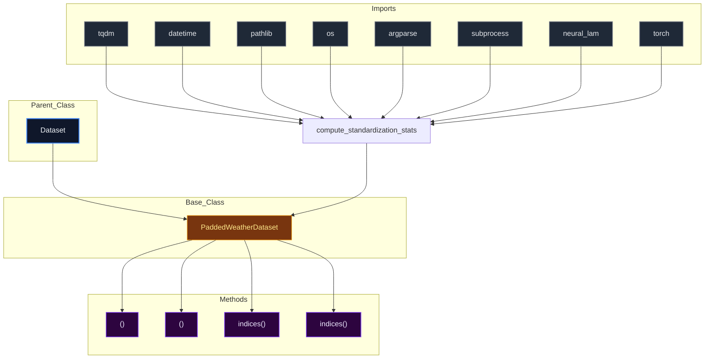

```mermaid
%%{init: {'flowchart': {'nodeSpacing': 60, 'rankSpacing': 80}}}%%
flowchart TD

module["compute_standardization_stats"]

subgraph Parent_Class
    Dataset["Dataset"]
end

subgraph Base_Class
    PaddedWeatherDataset["PaddedWeatherDataset"]
end

    Dataset --> PaddedWeatherDataset

subgraph Imports
    tqdm["tqdm"]
    datetime["datetime"]
    pathlib["pathlib"]
    os["os"]
    argparse["argparse"]
    subprocess["subprocess"]
    neural_lam["neural_lam"]
    torch["torch"]
end

    tqdm --> module
    datetime --> module
    pathlib --> module
    os --> module
    argparse --> module
    subprocess --> module
    neural_lam --> module
    torch --> module
    module --> PaddedWeatherDataset

subgraph Methods
    PaddedWeatherDataset___getitem__["()"]
    PaddedWeatherDataset___len__["()"]
    PaddedWeatherDataset_get_original_indices["indices()"]
    PaddedWeatherDataset_get_original_window_indices["indices()"]
end

    PaddedWeatherDataset --> PaddedWeatherDataset___getitem__
    PaddedWeatherDataset --> PaddedWeatherDataset___len__
    PaddedWeatherDataset --> PaddedWeatherDataset_get_original_indices
    PaddedWeatherDataset --> PaddedWeatherDataset_get_original_window_indices

classDef parent fill:#0f172a,stroke:#3b82f6,stroke-width:2px,color:#f1f5f9,font-size:16px
classDef base fill:#78350f,stroke:#f59e0b,stroke-width:1px,color:#fde68a,font-size:16px
classDef import fill:#1f2937,stroke:#6b7280,stroke-width:1.5px,color:#e5e7eb,font-size:16px
classDef method fill:#2d043f,stroke:#7c3aed,stroke-width:1.5px,color:#ede9fe,font-size:16px
classDef callNode fill:#064e3b,stroke:#10b981,stroke-width:1.5px,color:#d1fae5,font-size:16px
class Dataset parent
class PaddedWeatherDataset base
class tqdm,datetime,pathlib,os,argparse,subprocess,neural_lam,torch import
class PaddedWeatherDataset___getitem__,PaddedWeatherDataset___len__,PaddedWeatherDataset_get_original_indices,PaddedWeatherDataset_get_original_window_indices method
```
