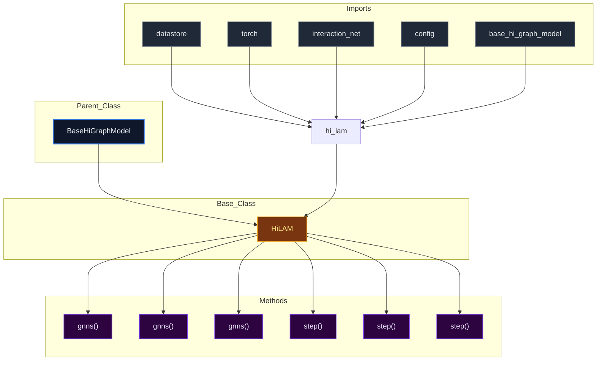

```mermaid
%%{init: {'flowchart': {'nodeSpacing': 60, 'rankSpacing': 80}}}%%
flowchart TD

module["hi_lam"]

subgraph Parent_Class
    BaseHiGraphModel["BaseHiGraphModel"]
end

subgraph Base_Class
    HiLAM["HiLAM"]
end

    BaseHiGraphModel --> HiLAM

subgraph Imports
    datastore["datastore"]
    torch["torch"]
    interaction_net["interaction_net"]
    config["config"]
    base_hi_graph_model["base_hi_graph_model"]
end

    datastore --> module
    torch --> module
    interaction_net --> module
    config --> module
    base_hi_graph_model --> module
    module --> HiLAM

subgraph Methods
    HiLAM_make_same_gnns["gnns()"]
    HiLAM_make_up_gnns["gnns()"]
    HiLAM_make_down_gnns["gnns()"]
    HiLAM_mesh_down_step["step()"]
    HiLAM_mesh_up_step["step()"]
    HiLAM_hi_processor_step["step()"]
end

    HiLAM --> HiLAM_make_same_gnns
    HiLAM --> HiLAM_make_up_gnns
    HiLAM --> HiLAM_make_down_gnns
    HiLAM --> HiLAM_mesh_down_step
    HiLAM --> HiLAM_mesh_up_step
    HiLAM --> HiLAM_hi_processor_step

classDef parent fill:#0f172a,stroke:#3b82f6,stroke-width:2px,color:#f1f5f9,font-size:16px
classDef base fill:#78350f,stroke:#f59e0b,stroke-width:1px,color:#fde68a,font-size:16px
classDef import fill:#1f2937,stroke:#6b7280,stroke-width:1.5px,color:#e5e7eb,font-size:16px
classDef method fill:#2d043f,stroke:#7c3aed,stroke-width:1.5px,color:#ede9fe,font-size:16px
classDef callNode fill:#064e3b,stroke:#10b981,stroke-width:1.5px,color:#d1fae5,font-size:16px
class BaseHiGraphModel parent
class HiLAM base
class datastore,torch,interaction_net,config,base_hi_graph_model import
class HiLAM_make_same_gnns,HiLAM_make_up_gnns,HiLAM_make_down_gnns,HiLAM_mesh_down_step,HiLAM_mesh_up_step,HiLAM_hi_processor_step method
```
