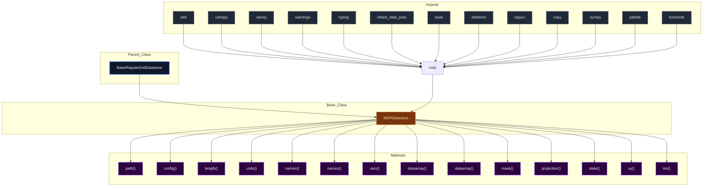

```mermaid
%%{init: {'flowchart': {'nodeSpacing': 60, 'rankSpacing': 80}}}%%
flowchart TD

module["mdp"]

subgraph Parent_Class
    BaseRegularGridDatastore["BaseRegularGridDatastore"]
end

subgraph Base_Class
    MDPDatastore["MDPDatastore"]
end

    BaseRegularGridDatastore --> MDPDatastore

subgraph Imports
    utils["utils"]
    cartopy["cartopy"]
    xarray["xarray"]
    warnings["warnings"]
    typing["typing"]
    mllam_data_prep["mllam_data_prep"]
    base["base"]
    datetime["datetime"]
    loguru["loguru"]
    copy["copy"]
    numpy["numpy"]
    pathlib["pathlib"]
    functools["functools"]
end

    utils --> module
    cartopy --> module
    xarray --> module
    warnings --> module
    typing --> module
    mllam_data_prep --> module
    base --> module
    datetime --> module
    loguru --> module
    copy --> module
    numpy --> module
    pathlib --> module
    functools --> module
    module --> MDPDatastore

subgraph Methods
    MDPDatastore_root_path["path()"]
    MDPDatastore_config["config()"]
    MDPDatastore_step_length["length()"]
    MDPDatastore_get_vars_units["units()"]
    MDPDatastore_get_vars_names["names()"]
    MDPDatastore_get_vars_long_names["names()"]
    MDPDatastore_get_num_data_vars["vars()"]
    MDPDatastore_get_dataarray["dataarray()"]
    MDPDatastore_get_standardization_dataarray["dataarray()"]
    MDPDatastore_boundary_mask["mask()"]
    MDPDatastore_coords_projection["projection()"]
    MDPDatastore_grid_shape_state["state()"]
    MDPDatastore_get_xy["xy()"]
    MDPDatastore_get_lat_lon["lon()"]
end

    MDPDatastore --> MDPDatastore_root_path
    MDPDatastore --> MDPDatastore_config
    MDPDatastore --> MDPDatastore_step_length
    MDPDatastore --> MDPDatastore_get_vars_units
    MDPDatastore --> MDPDatastore_get_vars_names
    MDPDatastore --> MDPDatastore_get_vars_long_names
    MDPDatastore --> MDPDatastore_get_num_data_vars
    MDPDatastore --> MDPDatastore_get_dataarray
    MDPDatastore --> MDPDatastore_get_standardization_dataarray
    MDPDatastore --> MDPDatastore_boundary_mask
    MDPDatastore --> MDPDatastore_coords_projection
    MDPDatastore --> MDPDatastore_grid_shape_state
    MDPDatastore --> MDPDatastore_get_xy
    MDPDatastore --> MDPDatastore_get_lat_lon

classDef parent fill:#0f172a,stroke:#3b82f6,stroke-width:2px,color:#f1f5f9,font-size:16px
classDef base fill:#78350f,stroke:#f59e0b,stroke-width:1px,color:#fde68a,font-size:16px
classDef import fill:#1f2937,stroke:#6b7280,stroke-width:1.5px,color:#e5e7eb,font-size:16px
classDef method fill:#2d043f,stroke:#7c3aed,stroke-width:1.5px,color:#ede9fe,font-size:16px
classDef callNode fill:#064e3b,stroke:#10b981,stroke-width:1.5px,color:#d1fae5,font-size:16px
class BaseRegularGridDatastore parent
class MDPDatastore base
class utils,cartopy,xarray,warnings,typing,mllam_data_prep,base,datetime,loguru,copy,numpy,pathlib,functools import
class MDPDatastore_root_path,MDPDatastore_config,MDPDatastore_step_length,MDPDatastore_get_vars_units,MDPDatastore_get_vars_names,MDPDatastore_get_vars_long_names,MDPDatastore_get_num_data_vars,MDPDatastore_get_dataarray,MDPDatastore_get_standardization_dataarray,MDPDatastore_boundary_mask,MDPDatastore_coords_projection,MDPDatastore_grid_shape_state,MDPDatastore_get_xy,MDPDatastore_get_lat_lon method
```
