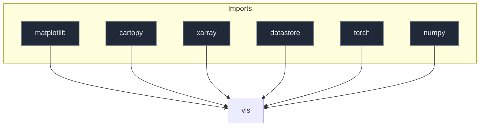

```mermaid
%%{init: {'flowchart': {'nodeSpacing': 60, 'rankSpacing': 80}}}%%
flowchart TD

module["vis"]

subgraph Imports
    matplotlib["matplotlib"]
    cartopy["cartopy"]
    xarray["xarray"]
    datastore["datastore"]
    torch["torch"]
    numpy["numpy"]
end

    matplotlib --> module
    cartopy --> module
    xarray --> module
    datastore --> module
    torch --> module
    numpy --> module

classDef parent fill:#0f172a,stroke:#3b82f6,stroke-width:2px,color:#f1f5f9,font-size:16px
classDef base fill:#78350f,stroke:#f59e0b,stroke-width:1px,color:#fde68a,font-size:16px
classDef import fill:#1f2937,stroke:#6b7280,stroke-width:1.5px,color:#e5e7eb,font-size:16px
classDef method fill:#2d043f,stroke:#7c3aed,stroke-width:1.5px,color:#ede9fe,font-size:16px
classDef callNode fill:#064e3b,stroke:#10b981,stroke-width:1.5px,color:#d1fae5,font-size:16px
class matplotlib,cartopy,xarray,datastore,torch,numpy import
```
