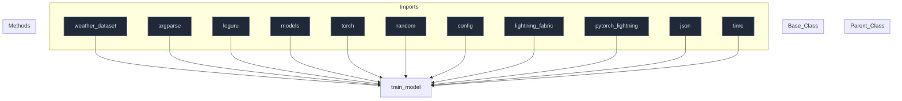

```mermaid
%%{init: {'flowchart': {'nodeSpacing': 60, 'rankSpacing': 80}}}%%
flowchart TD

module["train_model"]

subgraph Parent_Class
end

subgraph Base_Class
end


subgraph Imports
    weather_dataset["weather_dataset"]
    argparse["argparse"]
    loguru["loguru"]
    models["models"]
    torch["torch"]
    random["random"]
    config["config"]
    lightning_fabric["lightning_fabric"]
    pytorch_lightning["pytorch_lightning"]
    json["json"]
    time["time"]
end

    weather_dataset --> module
    argparse --> module
    loguru --> module
    models --> module
    torch --> module
    random --> module
    config --> module
    lightning_fabric --> module
    pytorch_lightning --> module
    json --> module
    time --> module

subgraph Methods
end


classDef parent fill:#0f172a,stroke:#3b82f6,stroke-width:2px,color:#f1f5f9,font-size:16px
classDef base fill:#78350f,stroke:#f59e0b,stroke-width:1px,color:#fde68a,font-size:16px
classDef import fill:#1f2937,stroke:#6b7280,stroke-width:1.5px,color:#e5e7eb,font-size:16px
classDef method fill:#2d043f,stroke:#7c3aed,stroke-width:1.5px,color:#ede9fe,font-size:16px
classDef callNode fill:#064e3b,stroke:#10b981,stroke-width:1.5px,color:#d1fae5,font-size:16px
class weather_dataset,argparse,loguru,models,torch,random,config,lightning_fabric,pytorch_lightning,json,time import

```
