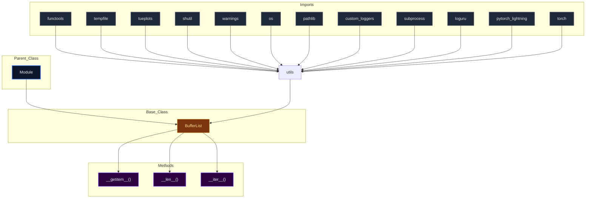

```mermaid
%%{init: {'flowchart': {'nodeSpacing': 60, 'rankSpacing': 80}}}%%
flowchart TD

module["utils"]

subgraph Parent_Class
    Module["Module"]
end

subgraph Base_Class
    BufferList["BufferList"]
end

    Module --> BufferList

subgraph Imports
    functools["functools"]
    tempfile["tempfile"]
    tueplots["tueplots"]
    shutil["shutil"]
    warnings["warnings"]
    os["os"]
    pathlib["pathlib"]
    custom_loggers["custom_loggers"]
    subprocess["subprocess"]
    loguru["loguru"]
    pytorch_lightning["pytorch_lightning"]
    torch["torch"]
end

    functools --> module
    tempfile --> module
    tueplots --> module
    shutil --> module
    warnings --> module
    os --> module
    pathlib --> module
    custom_loggers --> module
    subprocess --> module
    loguru --> module
    pytorch_lightning --> module
    torch --> module
    module --> BufferList

subgraph Methods
    BufferList___getitem__["__getitem__()"]
    BufferList___len__["__len__()"]
    BufferList___iter__["__iter__()"]
end

    BufferList --> BufferList___getitem__
    BufferList --> BufferList___len__
    BufferList --> BufferList___iter__

classDef parent fill:#0f172a,stroke:#3b82f6,stroke-width:2px,color:#f1f5f9,font-size:16px
classDef base fill:#78350f,stroke:#f59e0b,stroke-width:1px,color:#fde68a,font-size:16px
classDef import fill:#1f2937,stroke:#6b7280,stroke-width:1.5px,color:#e5e7eb,font-size:16px
classDef method fill:#2d043f,stroke:#7c3aed,stroke-width:1.5px,color:#ede9fe,font-size:16px
classDef callNode fill:#064e3b,stroke:#10b981,stroke-width:1.5px,color:#d1fae5,font-size:16px
class Module parent
class BufferList base
class functools,tempfile,tueplots,shutil,warnings,os,pathlib,custom_loggers,subprocess,loguru,pytorch_lightning,torch import
class BufferList___getitem__,BufferList___len__,BufferList___iter__ method

```