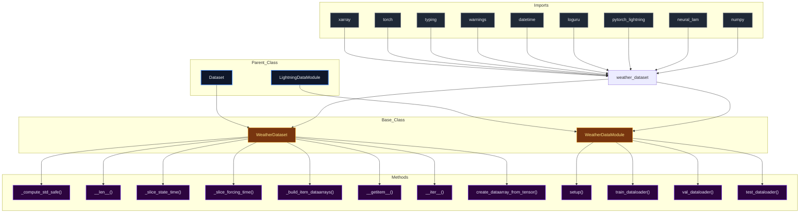

```mermaid
%%{init: {'flowchart': {'nodeSpacing': 60, 'rankSpacing': 80}}}%%
flowchart TD

module["weather_dataset"]

subgraph Parent_Class
    LightningDataModule["LightningDataModule"]
    Dataset["Dataset"]
end

subgraph Base_Class
    WeatherDataset["WeatherDataset"]
    WeatherDataModule["WeatherDataModule"]
end

    Dataset --> WeatherDataset
    LightningDataModule --> WeatherDataModule

subgraph Imports
    xarray["xarray"]
    torch["torch"]
    typing["typing"]
    warnings["warnings"]
    datetime["datetime"]
    loguru["loguru"]
    pytorch_lightning["pytorch_lightning"]
    neural_lam["neural_lam"]
    numpy["numpy"]
end

    xarray --> module
    torch --> module
    typing --> module
    warnings --> module
    datetime --> module
    loguru --> module
    pytorch_lightning --> module
    neural_lam --> module
    numpy --> module
    module --> WeatherDataset
    module --> WeatherDataModule

subgraph Methods
    WeatherDataset__compute_std_safe["_compute_std_safe()"]
    WeatherDataset___len__["__len__()"]
    WeatherDataset__slice_state_time["_slice_state_time()"]
    WeatherDataset__slice_forcing_time["_slice_forcing_time()"]
    WeatherDataset__build_item_dataarrays["_build_item_dataarrays()"]
    WeatherDataset___getitem__["__getitem__()"]
    WeatherDataset___iter__["__iter__()"]
    WeatherDataset_create_dataarray_from_tensor["create_dataarray_from_tensor()"]
    WeatherDataModule_setup["setup()"]
    WeatherDataModule_train_dataloader["train_dataloader()"]
    WeatherDataModule_val_dataloader["val_dataloader()"]
    WeatherDataModule_test_dataloader["test_dataloader()"]
end

    WeatherDataset --> WeatherDataset__compute_std_safe
    WeatherDataset --> WeatherDataset___len__
    WeatherDataset --> WeatherDataset__slice_state_time
    WeatherDataset --> WeatherDataset__slice_forcing_time
    WeatherDataset --> WeatherDataset__build_item_dataarrays
    WeatherDataset --> WeatherDataset___getitem__
    WeatherDataset --> WeatherDataset___iter__
    WeatherDataset --> WeatherDataset_create_dataarray_from_tensor
    WeatherDataModule --> WeatherDataModule_setup
    WeatherDataModule --> WeatherDataModule_train_dataloader
    WeatherDataModule --> WeatherDataModule_val_dataloader
    WeatherDataModule --> WeatherDataModule_test_dataloader

classDef parent fill:#0f172a,stroke:#3b82f6,stroke-width:2px,color:#f1f5f9,font-size:16px
classDef base fill:#78350f,stroke:#f59e0b,stroke-width:1px,color:#fde68a,font-size:16px
classDef import fill:#1f2937,stroke:#6b7280,stroke-width:1.5px,color:#e5e7eb,font-size:16px
classDef method fill:#2d043f,stroke:#7c3aed,stroke-width:1.5px,color:#ede9fe,font-size:16px
classDef callNode fill:#064e3b,stroke:#10b981,stroke-width:1.5px,color:#d1fae5,font-size:16px
class LightningDataModule,Dataset parent
class WeatherDataset,WeatherDataModule base
class xarray,torch,typing,warnings,datetime,loguru,pytorch_lightning,neural_lam,numpy import
class WeatherDataset__compute_std_safe,WeatherDataset___len__,WeatherDataset__slice_state_time,WeatherDataset__slice_forcing_time,WeatherDataset__build_item_dataarrays,WeatherDataset___getitem__,WeatherDataset___iter__,WeatherDataset_create_dataarray_from_tensor,WeatherDataModule_setup,WeatherDataModule_train_dataloader,WeatherDataModule_val_dataloader,WeatherDataModule_test_dataloader method

```