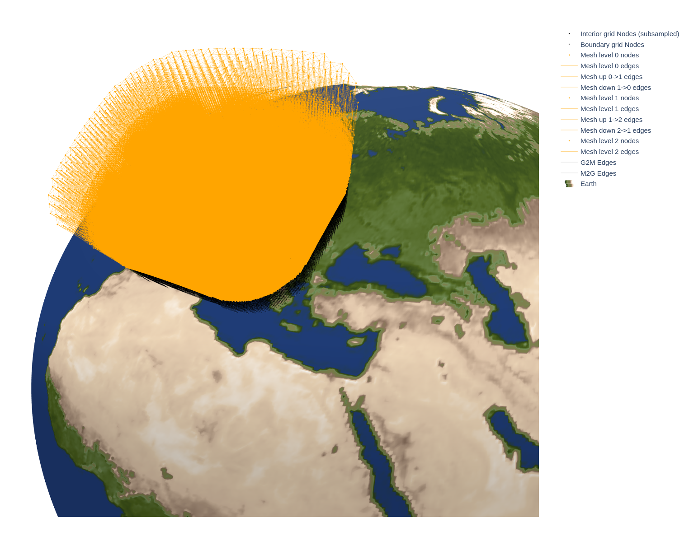
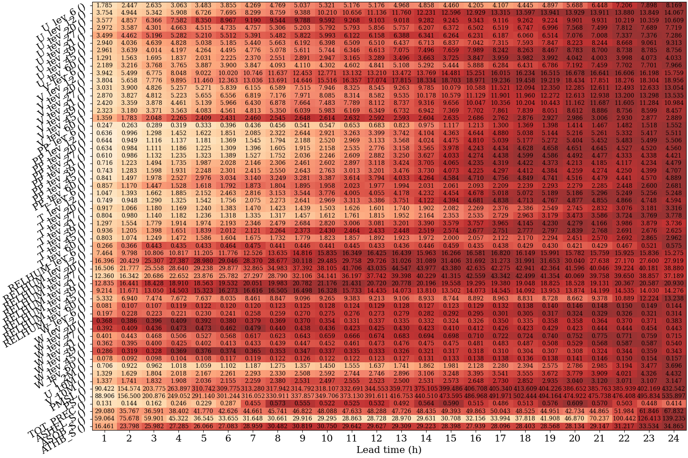

# End-to-End Model Training and Inference with COSMO Dataset Sample

This is a **lightweight guide** using a **COSMO sample dataset** and reduced settings so you can verify that your environment,
datapaths and training pipeline work end-to-end.

If you get stuck, ask in Slack (#neural-lam): [Slack
invite](https://join.slack.com/t/ml-lam/shared_invite/zt-2t112zvm8-Vt6aBvhX7nYa6Kbj_LkCBQ)

## Word of Warning

Even the sample setup is resource-intensive (GPU, storage, memory and time), but it's **much lighter than
the full paper reproduction**. For the full setup, see `docs/reproduce_paper.md`.

Prefer running on a GPU machine; consider SLURM/cluster/container setups.

## Step 0: Download sample resources & set path

Download the **COSMO sample dataset** and the published checkpoint into a local `WORKDIR` directory
(313 GB). All data/artifacts will be stored here.

```zsh
# Neural-LAM will read/write data from here
## --------> CHANGE THIS PATH <--------
WORKDIR=/path/to/your/working/directory # <--- CHANGE THIS
mkdir -p $WORKDIR
```

### COSMO sample dataset

Sample of the raw COSMO dataset (~2h for 313GB): [ETHZ Research Collection](https://www.research-collection.ethz.ch/entities/researchdata/3e24bbad-2885-4855-a100-78d18ed321f9)

```zsh
curl -L -o $WORKDIR/cosmo_sample.zip "https://libdrive.ethz.ch/index.php/s/OkneRXjZI4eum7e/download"
unzip $WORKDIR/cosmo_sample.zip -d $WORKDIR/cosmo_sample
mv $WORKDIR/cosmo_sample/720460/cosmo_sample.zarr $WORKDIR/cosmo_sample.zarr
rm -rf $WORKDIR/cosmo_sample $WORKDIR/cosmo_sample.zip
```

### Published checkpoint (optional)

* Published COSMO checkpoint (~1min for 201MB): [Zenodo](https://zenodo.org/records/15131838) \
`curl -L -o $WORKDIR/cosmo_model.ckpt "https://zenodo.org/api/records/15131838/files/cosmo_model.ckpt/content"`

## Step 1: Environment and installs

Required Python: >=3.10 & <=3.12.8. The paper reproduction was tested on v3.12.8 with this setup:

```zsh
# clone neural-lam repo research branch (e.g into home directory)
git clone --branch research https://github.com/joeloskarsson/neural-lam-dev.git
cd neural-lam-dev
SRCDIR=$(pwd)

# Using uv to manage Python versions and venvs (use what you prefer - pip/pdm/conda...)
curl -LsSf https://astral.sh/uv/install.sh | sh
uv python install 3.12
uv venv .venv --python 3.12
source .venv/bin/activate
uv pip install torch --index-url https://download.pytorch.org/whl/cu126 # match your cuda version
uv pip install ".[graph]" "zarr<3" # experiments were originally run with zarr<3

# mllam-data-prep (paper tag)
git clone --branch building-ml-lams https://github.com/sadamov/mllam-data-prep.git
uv pip install mllam-data-prep

# weather-model-graphs (paper tag)
git clone --branch building-ml-lams https://github.com/joeloskarsson/weather-model-graphs.git
uv pip install weather-model-graphs
```

## Step 2: Prepare sample configs and artifacts

Copy the COSMO scripts/configs/artifacts into `WORKDIR` so everything is co-located.
Minimal setup using `*_sample` variants:

```zsh
cp "$SRCDIR/scripts/cosmo_interior_config_sample.yaml" "$WORKDIR/"
cp "$SRCDIR/scripts/cosmo_era5_config_sample.yaml" "$WORKDIR/"
cp "$SRCDIR/scripts/cosmo_ifs_config_sample.yaml" "$WORKDIR/"
cp "$SRCDIR/scripts/cosmo_build_graphs_sample.sh" "$WORKDIR/"
cp "$SRCDIR/scripts/cosmo_model_config_era5_sample.yaml" "$WORKDIR/"
cp "$SRCDIR/scripts/cosmo_model_config_ifs_sample.yaml" "$WORKDIR/"
cp -r "$SRCDIR/scripts/artifacts/cosmo_land_sea_mask.zarr" "$WORKDIR/"
mkdir -p "$WORKDIR/figures"
cp "$SRCDIR/figures/earth_texture.jpeg" "$WORKDIR/figures/"
```

## Step 3: ERA5 & IFS download

Run these from `$SRCDIR`; outputs go under `$WORKDIR`.

```zsh
# ERA5 WeatherBench2 subset -> Zarr - (~2min for ~2GB)
python scripts/era_download.py \
    --start "2015-12-25T00" --end "2016-03-07T00" \
    --output-name cosmo_era5_sample.zarr \
    --output-dir "$WORKDIR"

# IFS WeatherBench2 subset -> Zarr (~30min for ~36GB)
python scripts/ifs_download.py \
    --start "2015-12-25T00" --end "2016-03-07T00" \
    --output-name cosmo_ifs_sample.zarr \
    --output-dir "$WORKDIR"
```

## Step 4: Impute missing IFS values

There are missing values in the IFS dataset that need to be addressed.

```zsh
python scripts/interp_na_ifs.py "$WORKDIR/cosmo_ifs_sample.zarr"
```

## Step 5: Land–sea mask (LSM)

The land-sea mask was already generated for your convenience and is available under
`scripts/artifacts/`. You already copied it as `$WORKDIR/cosmo_land_sea_mask.zarr`. If you want to
regenerate it, you can use the following commands:

<details>
<summary>Generate land–sea mask with micromamba (click to expand)</summary>

```zsh
# I have issues with GDAL system library (rasterio backend), hence I install it manually here
# with micromamba
if [ ! -x bin/micromamba ]; then
    ARCH=$(uname -m)
    case "$ARCH" in
        x86_64)
            MICROMAMBA_PKG=linux-64
            ;;
        aarch64)
            MICROMAMBA_PKG=linux-aarch64
            ;;
        *)
            echo "Unsupported architecture: $ARCH" >&2
            exit 1
            ;;
    esac
    curl -Ls "https://micro.mamba.pm/api/micromamba/${MICROMAMBA_PKG}/latest" | tar -xvj bin/micromamba
fi

if ! bin/micromamba env list | awk '{print $1}' | grep -q '^lam-lsm$'; then
    bin/micromamba create -n lam-lsm -c conda-forge python=3.12 gdal rasterio dask geopandas cartopy pyproj xarray shapely affine zarr -y
else
    echo "Reusing existing lam-lsm environment."
fi

bin/micromamba run -n lam-lsm python scripts/create_land_sea_mask.py \
    --source_zarr "$WORKDIR/cosmo_sample.zarr" \
    --output_zarr "$WORKDIR/cosmo_land_sea_mask.zarr"

# delete mamba env again (optional)
bin/micromamba env remove -n lam-lsm -y
rm -rf bin
```

</details>

## Step 6: Preprocess datastores with mllam-data-prep

This step builds the `.zarr` datastores that Neural-LAM will consume.
From now on we will work exclusively in the `$WORKDIR`.

```zsh
cd "$WORKDIR"
python -m mllam_data_prep --show-progress cosmo_interior_config_sample.yaml # ~2min
python -m mllam_data_prep --show-progress cosmo_era5_config_sample.yaml     # ~30s
python -m mllam_data_prep --show-progress cosmo_ifs_config_sample.yaml      # ~3min
```

## Step 7: Build graphs with weather-model-graphs

Use the sample configs to build a graph for the COSMO sample run. The resulting graph will be
identical to the one produced by the full dataset. The graph type is the same as the one used in the
best performing model.

```zsh
bash cosmo_build_graphs_sample.sh # ~2min

python -m neural_lam.plot_graph \
    --config_path cosmo_model_config_era5_sample.yaml \
    --graph_name rectangular_hierarchical \
    --save cosmo_graph.html \
    --mesh_level_dist 0.1 \
    --edge_width 0.1 \
    --mesh_edge_width 0.4 \
    --grid_node_size 0.2 \
    --mesh_node_size 0.8 \
    --boundary_grid_color grey \
    --mesh_color orange
```

Graph plotting is slow; use Firefox and optionally reduce the plotted region with
`--corner_filter_radius`. Earth texture lives at `figures/earth_texture.jpeg`.

Result should look like:



## Step 8: Train model

This step trains the hierarchical model on the **sample interior dataset** for 1 epoch just to confirm that the pipeline runs and the loss decreases from the first step. Additionally, `--num_nodes` is reduced to 1. For full paper-level training, see `docs/reproduce_paper.md`.

If you want to skip this part and use the pretrained model checkpoint instead, you can skip to Step 10 for evaluation.

```zsh
python -m neural_lam.train_model \
    --config_path "$WORKDIR/cosmo_model_config_era5_sample.yaml" \
    --model hi_lam \
    --graph_name rectangular_hierarchical \
    --hidden_dim 300 \
    --hidden_dim_grid 150 \
    --time_delta_enc_dim 32 \
    --processor_layers 2 \
    --batch_size 1 \
    --min_lr 0.001 \
    --epochs 1 \
    --val_interval 10 \
    --val_steps_to_log 1 2 3 4 \
    --ar_steps_eval 4 \
    --precision bf16-mixed \
    --plot_vars "T_2M" \
    --num_workers 8 \
    --num_nodes 1
```

This reduced training should not take longer than 15 minutes on a single GPU. If you are tracking with wandb
you should see a `train_loss_epoch` of ~10 and GPU-memory used should be around 45GB; system memory around 100GB.

## Step 9: Finetune from checkpoint

To finetune from a checkpoint (e.g., the one created in Step 8) we first need to locate the
`CHECKPOINT` from the run above. Then you need to replace <your_run> below with the actual folder
from that run.

Here we are also running a validation step to ensure there are no issues with the model or data
split. Again with reduced `--epochs`, `--val_interval`, and `--num_nodes`:

```zsh
CHECKPOINT_SAMPLE=$WORKDIR/saved_models/<your_run>/last.ckpt # replace <your_run>

python -m neural_lam.train_model \
    --config_path "$WORKDIR/cosmo_model_config_era5_sample.yaml" \
    --model hi_lam \
    --graph_name rectangular_hierarchical \
    --hidden_dim 300 \
    --hidden_dim_grid 150 \
    --time_delta_enc_dim 32 \
    --processor_layers 2 \
    --batch_size 1 \
    --lr 0.0001 \
    --min_lr 0.0001 \
    --epochs 2 \
    --val_interval 1 \
    --val_steps_to_log 1 2 3 4 8 12 16 20 24 \
    --ar_steps_train 12 \
    --ar_steps_eval 24 \
    --precision bf16-mixed \
    --plot_vars "T_2M" \
    --grad_checkpointing \
    --num_workers 4 \
    --num_nodes 1 \
    --restore_opt \
    --load ${CHECKPOINT_SAMPLE}
```

For a pure technical test you can skip this step entirely. It takes ~4 hours on a single GPU; the
system requirements are similar to the training above. If you didn't skip it, you might see that the
`train_loss_epoch` has increased because the loss is averaged over more steps, which are harder to
predict.

From validation you should see a RMSE scorecard like this on wandb:



## Step 10: Evaluate and save forecasts to Zarr

Finally, verify that evaluation works and that Neural-LAM can write sample forecasts to Zarr. Here
the `--val_steps_to_log` and `--ar_steps_eval` are reduced. Set the `CHECKPOINT_FT_SAMPLE` to the
path of your (finetuned) sample checkpoint. Or set it to the provided checkpoint at
`WORKDIR/cosmo_model.ckpt`.

```zsh
CHECKPOINT_FT_SAMPLE=$WORKDIR/saved_models/<your_finetune_run>/min_val_mean_loss.ckpt # replace <your_finetune_run>

python -m neural_lam.train_model \
    --model hi_lam \
    --epochs 1 \
    --eval test \
    --n_example_pred 1 \
    --ar_steps_eval 24 \
    --val_steps_to_log 1 6 12 18 24 \
    --hidden_dim 300 \
    --hidden_dim_grid 150 \
    --time_delta_enc_dim 32 \
    --processor_layers 2 \
    --num_nodes 1 \
    --batch_size 1 \
    --plot_vars "T_2M" "U_10M" \
    --precision bf16-mixed \
    --graph_name rectangular_hierarchical \
    --config_path "$WORKDIR/cosmo_model_config_ifs_sample.yaml" \
    --load ${CHECKPOINT_FT_SAMPLE} \
    --save_eval_to_zarr_path "$WORKDIR/cosmo_sample_forecasts.zarr"
```

This should create sample forecast outputs under your `$WORKDIR/cosmo_sample_forecasts.zarr` looking like this:

```zsh
<xarray.Dataset> Size: 1GB
Dimensions:                  (start_time: 1, elapsed_forecast_duration: 24, state_feature: 57, x: 582, y: 390)
Coordinates:

* elapsed_forecast_duration  (elapsed_forecast_duration) timedelta64[ns] 192B ...
* start_time                 (start_time) datetime64[ns] 8B 2016-02-27
* state_feature              (state_feature) <U13 3kB 'U_lev_6' ... 'ATHB_S'
  time                       (elapsed_forecast_duration) datetime64[ns] 192B dask.array<chunksize=(1,), meta=np.ndarray>
* x                          (x) int64 5kB 0 1 2 3 4 5 ... 577 578 579 580 581
* y                          (y) int64 3kB 0 1 2 3 4 5 ... 385 386 387 388 389
Data variables:
    state                    (start_time, elapsed_forecast_duration, state_feature, x, y) float32 1GB
                             dask.array<chunksize=(1, 1, 57, 582, 390), meta=np.ndarray>
```

Here is a sample forecast for 2m temperature from wandb. Of course it is poor given the limited training and data. But you get the idea!


AWESOME! You're in a good position to move on to the full COSMO reproduction. Or to further
experiment with your own configurations and datasets.
